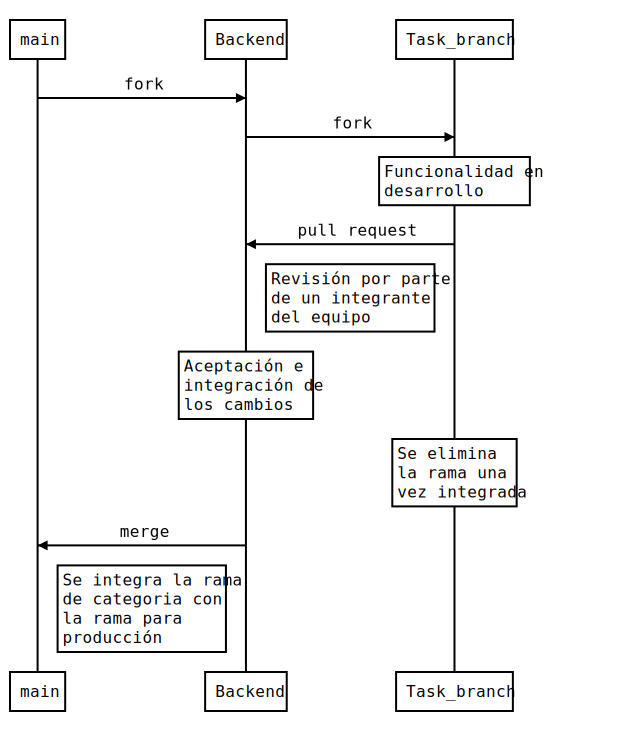

#Digital Booking

[Enlace al deploy en AWS](http://camada3grupo6frontend.s3-website.us-east-2.amazonaws.com/)

###Equipo

-  [Agustina Fenández]()
-  [Camilo Martínez]()
-  [Héctor Moreno]()
-  [Juliana Aparicio](https://www.linkedin.com/in/juliana-aparicio-dev/)
-  [Nicolás Flórez](https://www.linkedin.com/in/nmflorezr/)

###Secciones

1. [Resumen general](#resumen-general)
2. [Stack utilizado](#stack-utilizado)
3. [Resumen del desarrollo](#resumen-del-desarrollo-detallado)
   3.1. [Front End](#frontend)
   3.2. [Back End](#backEnd)
   3.3. [Bases de datos](#bases-de-datos)
   3.4. [Infraestructura](#infraestructura)
   3.5. [Testing](#testing)
4. [Flujo de trabajo](#flujo-de-trabajo)
5. [Papel de los integrantes](#papel-de-los-integrantes)

##Resumen general

Este proyecto fue desarrollado como proyecto final para un Bootcamp.
Se trata de un E-commerce enfocado en la renta de habitaciones, apartamentos, casas de campo e.t.c.
Navegando por la [pagina web](http://camada3grupo6frontend.s3-website.us-east-2.amazonaws.com/) como usuario del tipo Invitado puedes mirar los detalles de todos los productos, fechas disponibles, categorias e imagenes.

Una vez como usuario registrado provee principalmente la funcionalidad de reservar un producto para un rango de fechas, y también, desde una cuenta del tipo Administrador, provee la funcionalidad de crear nuevos productos.

Todas estas funcionalidades tambien son posibles de usar accediendo directamente a los endpoints de la API y utilizando el JWT devuelto como respuesta al iniciar sesión en las peticiones que requieren algún tipo de autorización.

###Desarrollo

A grandes rasgos, las tecnologias utilizadas en el proyecto fueron: Javascript junto con React para el Frontend, Java junto con SpringBoot para el Backend, MySQL como base de datos, y AWS y Terraform para La infraestructura y alojamiento.

Si te interesa conocer mas a detalle cada library, dependecnia o herramienta que usamos puede dirigirte a la sección de [Stack Utilizado](#stack-utilizado).

Por su parte, los testings de la interfaz fueron realizados de manera automatizada con Selenium IDE y documentado en archivos de Excel.

Si te interesa conocer cada detalle acerca del desarrollo del proyecto puedes consultar la sección de [Resumen del desarrollo (Detallado)](#resumen-del-desarrollo-detallado).

##Stack Utilizado

###Backend:

**Languages:** Java
**IDE:** IntelliJ IDEA 2022.3 (Community Edition) Build #IC-223.7571.182, built on November 29, 2022. Runtime version: 17.0.5+1-b653.14 amd64.
**VM:** OpenJDK 64-Bit Server VM by JetBrains s.r.o.
**Frameworks:** Spring Boot 2.7.4 Java version 17, Spring Security, Spring Data 2.7.5, Maven, JUnit 5.9.0.
**Libraries:** Log4j, Jackson 2.14.0-rc2, mysql connector 8.0.31, Lombok 1.18.24, querydsl-jpa, springdoc-openapi-ui < 1.6.12 (Swagger), jsonwebtoken 0.9.1 (JWT), Javax Mail 1.6.2, Mockito 2.0.2 beta.

###Frontend:

**Languages:** HTML, CSS, Javascript.
**IDE:** Visual Studio Code
**Preprocessors:** SASS, Babel
**Libraries:** React, React-router-dom, GSAP, React-date-picker, React-image-gallery, Axios, Vitest.
**Dependencies manager:** NPM.
**Bundler:** Es-build (Vite).
**Framework:** No aplica.

###Base de datos:

###Infraestructura:

###Testing:

##Resumen del desarrollo (Detallado)

###Backend:

###Frontend:

Como está declarado en las secciones [Resumen general](#resumen-general) y [Stack utilizado](#stack-utilizado), para el desarrollo FrontEnd de este proyecto se utilizó Javascript con React como libreria principal, la estructura de SPA se mantuvo utilizando la depedencia React-router-dom como enrutador, y el estilizado fue hecho utilizando SASS(Scss) por medio de una dependencia del mismo nombre que permite importar ese tipo de archivos directamente en JS sin necesidad de compilarlos a CSS vanilla primero. Y hablando del aspecto estético, las animaciones, transiciones y demas efectos de la aplicación fueron realizados utilizando una library llamada GSAP (Greensock Animations Platform).

La para las conexiones a la API se utilizó Axios para alivianar la sintaxis, sobretodo a la hora de hacer Posts.

Para crear la estructura del proyecto de lado del front se utilizó Vite, la cual trae incluidas y configuradas _out of the box_ NPM como gestor de dependencias y Es-build como bundler, preprocesador y compilador. Fue elegido Vite por sobre CRA por su notable diferencia de tiempo a la hora de compilar tanto los cambios en tiempo real, como al momento de hacer un build para producción, esto gracias al bundler que se utiliza, el cual en CRA es Webpack, y por su menor cantidad de dependecias incluidas por defecto.

Los testings unitarios y de componentes se hicieron utilizando Vitest la cual es la library oficial de Vite para realizar tests cuando se utiliza su inicializador de proyectos.

###Base de datos:

###Infraestructura:

###Testing:

#Flujo de trabajo:

Durante la totalidad del proyecto se uso Gitlab y Git como controladores de versiones, esto nos permitió a los integrantes todos los integrantes del grupo poder avanzar en cada una de las tareas distribuidas a la par y poder integrar los resultados entre si una vez terminados.

Siendo mas precisos; la rama de producción (main) es dividida en 2 ramas de trabajo principales (Backend y Frontend). Cuando se requiere desarrollar alguna funcionalidad sobre alguna de estas ramas se hace una copia de la misma con el nombre general de los cambios o caracteristicas a agregar. Una vez estos cambios están terminados se hace una solicitud para integrarlos en la rama de la categoría (ej: Backend), cuando esta solicitud se hace otro miembro del equipo debe revisar y corroborar que todo lo que se hizo es correcto y no perjudicará el funcionamiento de lo que ya está hecho en esta rama. Cuando una etapa termina las ramas de cada categoría son integradas en la rama de producción, creando así una nueva "versión" de la aplicación, la cual será usada como punto de partida para la creación de las nuevas funcionalidades en la siguiente etapa.

Lo anteriormente dicho puede ser mejormente entendido a través del siguiente esquema:

##Papel de los integrantes

###Agustina Fenández

####Cargos principales:

####Tareas particulares:

###Camilo Martínez

####Cargos principales:

####Tareas particulares:

###Héctor Moreno

####Cargos principales:

####Tareas particulares:

###Juliana Aparicio

####Cargos principales:

####Tareas particulares:

###Nicolás Flórez

####Cargos principales:
Desarrollador del Frontend

####Tareas particulares:

-  Creación de componentes
-  Creación de vistas
-  Estilizado
-  Conexion con API
-  Integración de animaciones
-  Integración de transiciones
-  Integración de dependencias o recursos externos
-  Creación de estructura general de la documentación

#####Muchas gracias por llegar hasta acá, y recuerda, con Digital Booking puedes estar en cualquier lugar y sentirte como en tu hogar.
